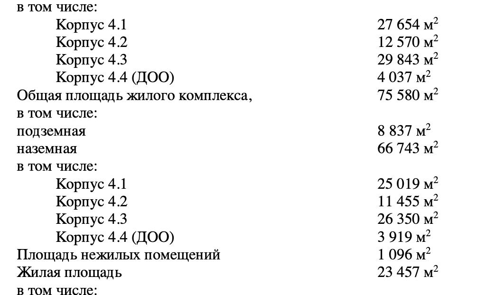
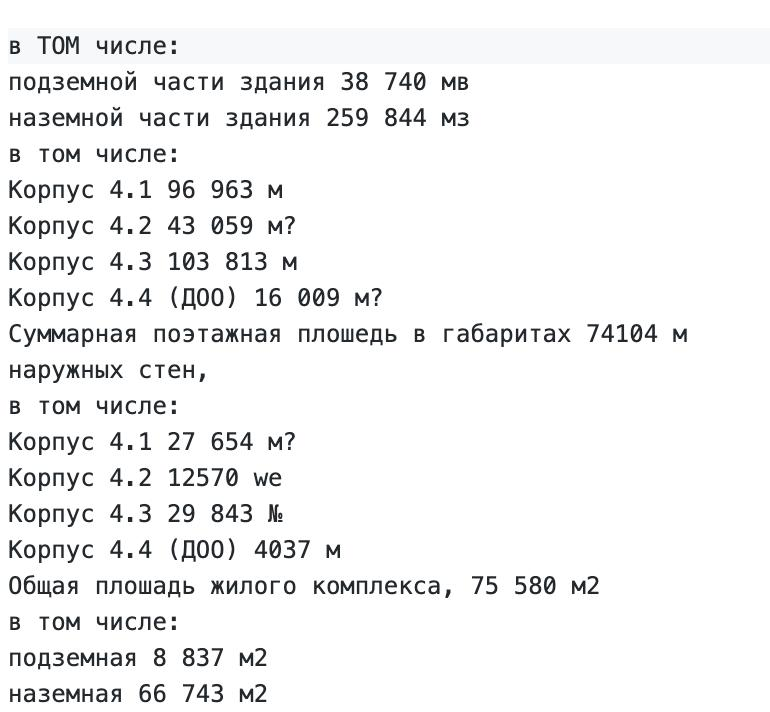

# PDF Extractor OCR

Simple and fast API for extracting text from PDF documents using **Tesseract OCR** with support for **Russian**, **Kazakh** and **English** languages.

Main purpose — extraction of text after a certain heading (keyword/phrase) from scanned or digitally created PDF documents.

## Current Features

- PDF → Images conversion (using `pdf2image`)
- OCR with Tesseract (languages: rus + kaz + eng)
- Search for heading/keyword and extraction of **text below it** (very useful for protocol/statement/act forms)
- Returns **both** full text and extracted part
- Saves results in two formats:
  - JSON (with metadata)
  - Plain text (extracted + full)
- Asynchronous task-like processing (currently in-memory result storage)
- FastAPI-based API (not shown in provided code snippet)

## Current System Design (high-level)

```
Client → FastAPI endpoint → Upload PDF + (optional) heading
        ↓
      Generate result_id
        ↓
      Save PDF temporarily
        ↓
 [Background/Direct task]
        ↓
Convert PDF → Images (pdf2image)
        ↓
OCR each page (pytesseract, rus+kaz+eng)
        ↓
Concatenate all pages text
        ↓                       ┌──────────────┐
If heading provided? ────────→│ Find heading │→ Crop/extract text after it
        │                      └──────────────┘
        │ No heading           Full text
        ▼
   Save results:
   • JSON  → /storage/logs/json/{id}.json
   • TXT   → /storage/logs/texts/{id}.txt          (extracted)
   • TXT   → /storage/logs/texts/{id}_full.txt     (complete OCR)
        ↓
   Update in-memory result (or return directly)
        ↓
   Clean up temporary PDF
```

## Tech Stack

- **Python** 3.12
- **FastAPI** + **Uvicorn**
- **pdf2image** (+ poppler-utils)
- **pytesseract** + Tesseract OCR
- **Pillow** (PIL)
- **Docker** + **docker-compose**

## Project Structure (current)

```
.
├── app/
│   ├── main.py               # (not shown - most likely FastAPI app)
│   ├── ocr/
│   │   ├── pdf_converter.py
│   │   ├── ocr_engine.py
│   │   └── text_utils.py
│   └── tasks/
│       └── ocr_task.py
├── storage/
│   ├── logs/
│   │   ├── json/
│   │   └── texts/
├── Dockerfile
├── docker-compose.yml
└── requirements.txt
```

## Installation (Docker)

```bash
# Build & start
docker-compose up --build

# or in background
docker-compose up -d --build
```

### Before vs After

<div align="center">
  
  
</div>


---
